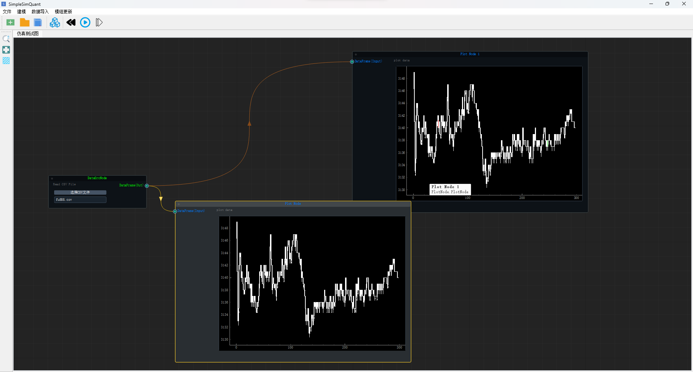

# SimpleSimQuant

SimpleSimQuant是来自于simulink的启发，期望做一个类似于simulink的图形模块化的量化框架，希望能够用极少的代码，具备一些逻辑思维，轻松将自己的交易思想搭建出量化模型，目前还在开发中，期待各位大佬提意见。

注意:该项目当前只是一个展示的界面demo，不具备任何实际的功能，后期会上传代码。

## LICENSE
    MIT

SimpleSimQuan 需要依赖的相关开源库

- QDarkStyleSheet: [https://github.com/ColinDuquesnoy/QDarkStyleSheet](https://github.com/ColinDuquesnoy/QDarkStyleSheet).
- NodeGraphQt: [https://github.com/jchanvfx/NodeGraphQt](https://github.com/jchanvfx/NodeGraphQt).
- qtpy: [https://github.com/spyder-ide/qtpy](https://github.com/spyder-ide/qtpy).
- PyQt5
- pyqtgraph

## 软件截图

